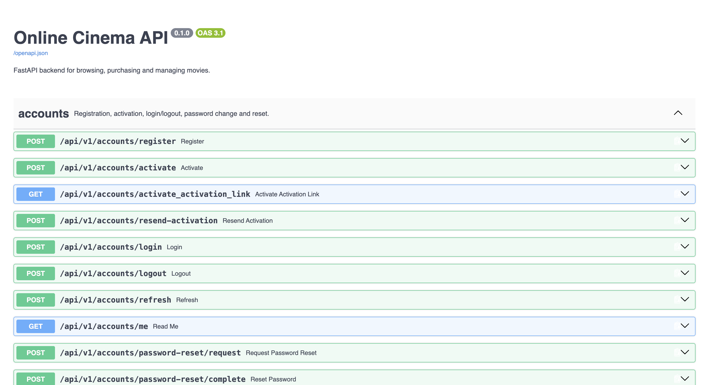
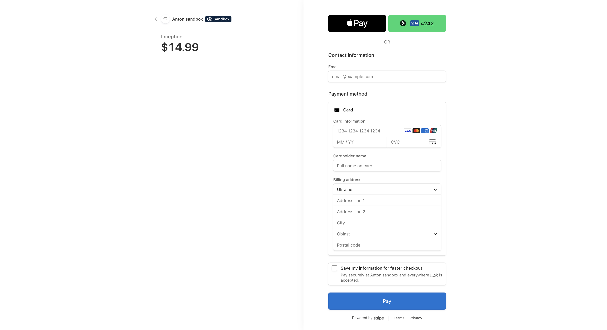
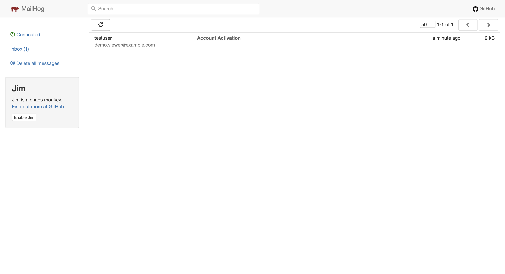
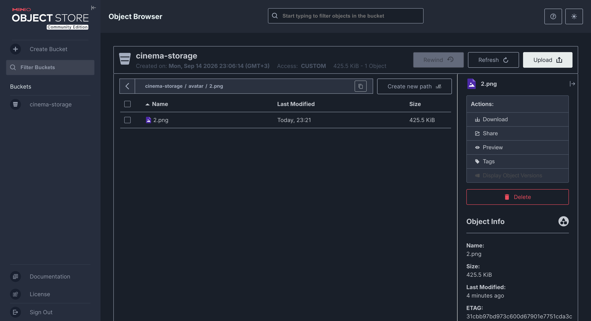

# 🎬 Online Cinema API

**🔗 Live on AWS EC2: [http://3.71.213.199](http://3.71.213.199)**

A full-featured, production-ready backend for an online cinema platform — built with **FastAPI** and **async SQLAlchemy 2.0**. Browse and search a movie catalog, favorite/like/rate/comment on movies, manage a shopping cart, place orders, and pay via **Stripe** — with real email notifications, S3-compatible avatar storage, 286 automated tests, and a CI/CD pipeline that auto-deploys to AWS EC2 only after every test passes.

This is a capstone portfolio project built for Mate Academy.

---

## Try It Live

The app is deployed and running on AWS EC2: **[http://3.71.213.199](http://3.71.213.199)**

A read/write demo account (regular `USER` role — no admin rights) is available to try the full customer flow — browse, favorite, add to cart, check out, pay with Stripe test mode:

<table>
<tr><td>Email</td><td><code>demo.viewer@example.com</code></td></tr>
<tr><td>Password</td><td><code>StrongPassword123!</code></td></tr>
</table>

`/docs`, `/redoc`, and `/openapi.json` sit behind HTTP Basic Auth in production (see [Security Notes](#security-notes)) — message me and I'll share the credentials, same for an `ADMIN`-role account to try staff-only endpoints. I'm not publishing either in this README, since this is a live public server and not a sandboxed demo.

---

## Overview

<table>
<tr><td><b>Modules</b></td><td>Accounts & Auth · User Profiles · Movies Catalog · Favorites/Likes/Ratings/Comments · Cart · Orders · Payments (Stripe)</td></tr>
<tr><td><b>API endpoints</b></td><td>70+ documented routes across 6 routers</td></tr>
<tr><td><b>Tests</b></td><td>286 (integration + end-to-end)</td></tr>
<tr><td><b>Roles</b></td><td><code>USER</code> · <code>MODERATOR</code> · <code>ADMIN</code> (RBAC on every write endpoint)</td></tr>
<tr><td><b>Infra</b></td><td>PostgreSQL, Redis, Celery, MinIO, MailHog, Nginx — all containerized</td></tr>
<tr><td><b>CI/CD</b></td><td>GitHub Actions — 5 parallel test jobs, then a gated auto-deploy to AWS EC2</td></tr>
</table>

In one sentence: it's the backend for an e-commerce-style movie streaming service — register, browse a paginated/filterable catalog, favorite and rate movies, add them to a cart, check out into an order, pay with a real Stripe Checkout Session, and get emailed about all of it — with an admin layer that can manage the entire catalog and inspect any user's activity.

---

## Screenshots

<table>
<tr><td><b>Swagger UI</b> — <code>http://localhost:8000/docs</code></td><td></td></tr>
<tr><td><b>Stripe Checkout</b> — a real payment session</td><td></td></tr>
<tr><td><b>MailHog</b> — captured emails, <code>http://localhost:8025</code></td><td></td></tr>
<tr><td><b>MinIO Console</b> — uploaded avatars, <code>http://localhost:9001</code></td><td></td></tr>
</table>

---

## Table of Contents

- [Try It Live](#try-it-live)
- [Features](#features)
- [Architecture](#architecture)
- [Data Model & Business Rules](#data-model--business-rules)
  - [Accounts & Profiles](#accounts--profiles)
  - [Movies Catalog](#movies-catalog)
  - [Cart](#cart)
  - [Orders](#orders)
  - [Payments](#payments)
- [Tech Stack](#tech-stack)
- [Project Structure](#project-structure)
- [Getting Started](#getting-started)
- [API Documentation](#api-documentation)
- [Example Requests](#example-requests)
- [Running Tests](#running-tests)
- [CI/CD](#cicd)
- [Deployment to AWS EC2](#deployment-to-aws-ec2)
- [Security Notes](#security-notes)
- [License](#license)

---

## Features

### 🔐 Accounts & Auth
- Registration with email activation (24h token TTL, auto-cleaned by a scheduled Celery task)
- JWT access/refresh token pairs — login, logout, refresh
- Password reset via emailed token
- Role-based access control — `USER`, `MODERATOR`, `ADMIN` — enforced per-endpoint via FastAPI dependencies
- Admin endpoints to change a user's group or activate/deactivate accounts

### 👤 Profiles
- One profile per user — first/last name, gender, date of birth, bio
- Avatar upload/replace/delete, stored in MinIO (S3-compatible object storage)
- Validated image uploads (type/size checks before anything touches storage)

### 🎥 Movies
- Paginated catalog with search (name/description/star/director), filters (genre, certification, year, price range, IMDB rating) and sorting
- Full CRUD for movies, genres, stars, directors, certifications (`MODERATOR`/`ADMIN` only)
- Favorites — personal watchlist
- Like / dislike — one reaction per user per movie, switchable
- 1–10 ratings — one score per user per movie, updatable
- Nested (threaded) comments, with an email notification sent to a comment's author when someone replies

### 🛒 Cart
- Add/remove movies, view cart with computed total price
- Blocks adding a movie that's already in the cart, or already purchased
- Admin can inspect any user's cart

### 📦 Orders
- Checkout converts the current cart into an `Order` + `OrderItem`s, **locking in the price at that moment** (`price_at_order`) — later catalog price changes never retroactively affect a placed order
- Cancel an order (only while it's still `pending`)
- Admin can view any user's order history

### 💳 Payments
- Stripe Checkout Session created per order
- Payment confirmation is driven entirely by a **Stripe webhook**, not by the client redirect — so it's correct even if the user closes the tab before the "success" page loads
- Webhook handling is **idempotent** — replayed/duplicate Stripe events are detected and ignored, they never double-charge or double-record a payment
- Refunds (`MODERATOR`/`ADMIN`), which also flip the linked order back to `canceled`
- Payment history — own, or (for staff) any user's, filterable by status/date

### 🧰 Infrastructure
- Async SQLAlchemy 2.0 + PostgreSQL + Alembic migrations
- Celery + Redis for scheduled background work
- MailHog for local/dev/test email capture (no real emails ever sent outside prod)
- MinIO (S3-compatible) for avatar storage
- Nginx reverse proxy in front of the app, gating `/docs`, `/redoc`, `/openapi.json` behind Basic Auth in production
- Every endpoint that can fail documents its exact status codes and example error bodies in the OpenAPI schema

---

## Architecture

The codebase follows a strict **layered architecture**, one direction of dependency only:

```
routes/  →  services/  →  database/models/
(HTTP)      (business        (SQLAlchemy
             logic)           ORM)
```

- **`routes/`** — FastAPI path operations only. Parse/validate the request (via `schemas/`), call exactly one `services/` function, return its result. No business logic lives here.
- **`services/`** — all business logic: validation rules, ownership checks, the actual database queries, raising the right `HTTPException` with the right status code. Fully independent of HTTP — could be called from a CLI or a Celery task with no changes.
- **`database/models/`** — SQLAlchemy ORM models, one module per domain (`accounts`, `movies`, `carts`, `orders`, `payments`), plus Alembic migrations.
- **`schemas/`** — Pydantic request/response models — the only things a route is allowed to accept from or return to the outside world.
- **`security/`** — JWT issuing/verification, password hashing, and the `require_roles(...)` dependency used to gate every protected endpoint.
- **`storages/`** and **`payments/`** — thin abstractions (`S3StorageInterface`, `PaymentGatewayInterface`) around MinIO and Stripe respectively, so the business logic never talks to a third-party SDK directly — this is also what makes them trivially fakeable in tests (see `tests/doubles/`).

This separation is also why the route function name is never the same as its underlying service function — `add_to_favorites` (route) calls `add_movie_to_favorites` (service) — keeping the two import namespaces unambiguous.

---

## Data Model & Business Rules

### Accounts & Profiles

| Entity | Key fields |
|---|---|
| `UserModel` | email, hashed password, `is_active`, `group_id` |
| `UserGroup` | `USER` / `MODERATOR` / `ADMIN` |
| `UserProfileModel` | first/last name, gender, date of birth, avatar (S3 key), 1:1 with `UserModel` |
| `ActivationTokenModel` / `PasswordResetTokenModel` / `RefreshTokenModel` | short-lived tokens, cleaned up on a schedule |

### Movies Catalog

| Entity | Notes |
|---|---|
| `MovieModel` | name, year, duration, IMDB score, price, description; M2M with genres/stars/directors |
| `GenreModel` / `StarModel` / `DirectorModel` | reference data, editable by staff |
| `CertificationModel` | age rating (e.g. PG-13) |
| `FavoriteMovieModel` | M2M association, user ↔ movie |
| `MovieLikeDislikeModel` | one row per (user, movie), enum `like`/`dislike` |
| `MovieRateModel` | one row per (user, movie), integer 1–10 |
| `MovieCommentModel` | self-referencing (`parent_id`) for threaded replies |

### Cart

| Entity | Notes |
|---|---|
| `CartModel` | one per user, created lazily on first add |
| `CartItem` | (cart, movie) pair, unique per pair |

### Orders

| Entity | Notes |
|---|---|
| `OrderModel` | status: `pending` / `paid` / `canceled` |
| `OrderItemModel` | `price_at_order` — snapshot of the movie's price at checkout time, immutable afterward |

### Payments

| Entity | Notes |
|---|---|
| `PaymentModel` | status: `successful` / `canceled` / `refunded`; stores Stripe's `external_payment_id` for idempotency |
| `PaymentItemModel` | `price_at_payment` — mirrors the order item's locked-in price |

---

## Tech Stack

| Layer | Technology |
|---|---|
| Framework | FastAPI, Uvicorn (dev) / Gunicorn (prod) |
| Database | PostgreSQL, SQLAlchemy 2.0 (async), Alembic |
| Auth | JWT (`PyJWT`), Argon2 password hashing (`pwdlib`) |
| Background tasks | Celery + Redis |
| Email | `aiosmtplib`, Jinja2 HTML templates, MailHog (dev/test) |
| Object storage | MinIO (S3-compatible), `aioboto3` |
| Payments | Stripe (Checkout Sessions, Webhooks, Refunds) |
| Reverse proxy | Nginx (Basic Auth on docs endpoints) |
| Dependency management | Poetry |
| Testing | Pytest, `pytest-asyncio`, `httpx`, SQLite (in-memory, for tests) |
| Linting | flake8 (+ bugbear, annotations, quotes, variable-names plugins) |
| Containerization | Docker, Docker Compose — separate dev / test / prod configs |
| CI/CD | GitHub Actions — per-module test jobs + Docker e2e job → gated auto-deploy |

---

## Project Structure

```
.
├── src/
│   ├── config/            # Settings & dependency injection
│   ├── database/          # Models, migrations, validators, seed data
│   ├── exceptions/         # Custom exception hierarchies
│   ├── notifications/      # Email sending + HTML templates
│   ├── payments/            # Stripe gateway abstraction (PaymentGatewayInterface)
│   ├── routes/              # FastAPI routers — accounts, movies, carts, orders, payments, profiles
│   ├── schemas/              # Pydantic request/response models
│   ├── security/              # JWT, password hashing, require_roles() dependency
│   ├── services/               # Business logic layer
│   ├── storages/                 # S3/MinIO abstraction (S3StorageInterface)
│   ├── tasks/                    # Celery app & scheduled tasks
│   ├── tests/                     # integration/ + e2e/ suites, doubles (fakes/stubs)
│   └── validation/                 # Custom field validators
├── commands/                          # Shell scripts — migrations, server start, auth setup, deploy
├── configs/nginx/                       # Nginx reverse-proxy config
├── docker/                                # Per-service Dockerfiles (nginx, mailhog, minio_mc, tests)
├── envs/                                    # .env.example.* templates (real .env.* files are gitignored)
├── docker-compose-dev.yml
├── docker-compose-prod.yml
├── docker-compose-tests.yml
└── .github/workflows/                          # ci-pipeline.yml + cd-pipeline.yml
```

---

## Getting Started

### Prerequisites
- Docker & Docker Compose
- Python 3.10+ and [Poetry](https://python-poetry.org/) (only if you want to run things outside Docker)

### Environment Variables

```bash
  cp envs/.env.example.local envs/.env.local
```

Real `.env.*` files are gitignored — never commit them. `docker-compose-dev.yml`/`-prod.yml`/`-tests.yml` each load a different one, so not every variable applies to every environment.

**PostgreSQL**

| Variable | Purpose |
|---|---|
| `POSTGRES_DB` | Database name the app connects to |
| `POSTGRES_DB_PORT` | Port Postgres listens on (mapped to the host in dev) |
| `POSTGRES_USER` / `POSTGRES_PASSWORD` | Database credentials |
| `POSTGRES_HOST` | Hostname of the Postgres container (service name in Docker's internal network) |

**pgAdmin** (dev/prod only — a web UI for browsing the database)

| Variable | Purpose |
|---|---|
| `PGADMIN_DEFAULT_EMAIL` / `PGADMIN_DEFAULT_PASSWORD` | Login credentials for the pgAdmin UI |

**JWT / Auth**

| Variable | Purpose |
|---|---|
| `SECRET_KEY_ACCESS` | Signs short-lived access tokens |
| `SECRET_KEY_REFRESH` | Signs long-lived refresh tokens — kept separate from the access key so a leaked access token alone can't be used to mint new ones |
| `JWT_SIGNING_ALGORITHM` | Signing algorithm (`HS256`) |

**Email (MailHog in dev/test — a fake SMTP server that never sends real mail)**

| Variable | Purpose |
|---|---|
| `EMAIL_HOST` / `EMAIL_PORT` | SMTP server the app connects to (MailHog's container, in dev/test) |
| `EMAIL_HOST_USER` / `EMAIL_HOST_PASSWORD` | SMTP auth credentials |
| `EMAIL_USE_TLS` | Whether to use STARTTLS when sending |
| `MAILHOG_USER` / `MAILHOG_PASSWORD` | Basic Auth for MailHog's own web UI (`:8025`), *not* used by the app itself |
| `MAILHOG_API_PORT` | Port MailHog's web UI/API listens on (tests only) |

**Stripe**

| Variable | Purpose |
|---|---|
| `STRIPE_SECRET_KEY` | Server-side Stripe API key — creates Checkout Sessions and refunds |
| `STRIPE_WEBHOOK_SECRET` | Verifies the `Stripe-Signature` header on incoming webhooks, so a payment can't be faked by POSTing to the webhook endpoint directly |

**MinIO (S3-compatible object storage, used for profile avatars)**

| Variable | Purpose |
|---|---|
| `MINIO_ROOT_USER` / `MINIO_ROOT_PASSWORD` | Root credentials for the MinIO server |
| `MINIO_HOST` / `MINIO_PORT` | Where the app reaches MinIO |
| `MINIO_STORAGE` | Name of the bucket avatars are uploaded into |

**Nginx** (prod only)

| Variable | Purpose |
|---|---|
| `API_USER` / `API_PASSWORD` | Basic Auth credentials gating `/docs`, `/redoc`, and `/openapi.json` in production, so the API surface isn't publicly browsable |

### Running in Development

```bash
  docker compose -f docker-compose-dev.yml up --build
```

| Service | URL | Purpose |
|---|---|---|
| API | `http://localhost:8000` | The FastAPI app itself |
| Swagger UI | `http://localhost:8000/docs` | Interactive API docs |
| ReDoc | `http://localhost:8000/redoc` | Alternative API docs |
| pgAdmin | `http://localhost:3333` | PostgreSQL admin UI |
| MailHog | `http://localhost:8025` | Captured outgoing emails |
| MinIO Console | `http://localhost:9001` | Object storage admin UI |

On first startup, the `migrator` container automatically applies all Alembic migrations and then seeds the database — user groups (`USER`/`MODERATOR`/`ADMIN`), an admin account, and ~100 movies (with genres/stars/directors/certifications) loaded from `src/database/seed_db/imdb_movies.csv`. This runs the same way in every environment (dev, tests, and production) — the moment the stack is up, the catalog is already populated and ready to browse, no manual step required.

---

## API Documentation

Full interactive docs live at `/docs` (Swagger) and `/redoc` (ReDoc) once the app is running. Every endpoint that can raise an error documents its exact status codes and an example error body — open any endpoint's **Responses** section in Swagger to see every failure mode without reading a line of source.

In production, `/docs`, `/redoc`, and `/openapi.json` sit behind Nginx Basic Auth (`API_USER`/`API_PASSWORD`).

---

## Example Requests

A minimal end-to-end flow, using `curl` against a locally running instance:

```bash
    # 1. Register
    curl -X POST http://localhost:8000/api/v1/accounts/register \
      -H "Content-Type: application/json" \
      -d '{"email": "me@example.com", "password": "StrongPass123!"}'
    
    # 2. Activate (token arrives by email — check MailHog at :8025)
    
    # 3. Log in
    curl -X POST http://localhost:8000/api/v1/accounts/login/ \
      -H "Content-Type: application/json" \
      -d '{"email": "me@example.com", "password": "StrongPass123!"}'
    # → { "access_token": "...", "refresh_token": "..." }
    
    # 4. Browse the catalog
    curl "http://localhost:8000/api/v1/movies?search=inception&sort_by=imdb&order=desc"
    
    # 5. Add a movie to your cart (auth required)
    curl -X POST http://localhost:8000/api/v1/carts/1 \
      -H "Authorization: Bearer <access_token>"
    
    # 6. Check out into an order
    curl -X POST http://localhost:8000/api/v1/orders \
      -H "Authorization: Bearer <access_token>"
    
    # 7. Pay — creates a real Stripe Checkout Session
    curl -X POST http://localhost:8000/api/v1/payments/1 \
      -H "Authorization: Bearer <access_token>"
    # → { "session_id": "...", "checkout_url": "https://checkout.stripe.com/..." }
```

---

## Running Tests

The project ships with **286 tests** — integration tests (service-layer, against a real ephemeral SQLite DB) and end-to-end tests (full HTTP flow against real MailHog + MinIO containers).

| Suite | What it covers | Isolation |
|---|---|---|
| `test_integration/` | Accounts, Movies, Carts & Orders, Payments, Profiles — service-layer correctness, RBAC, edge cases | Fresh SQLite DB per test, faked S3/email |
| `test_e2e/` | Full registration→activation→login flow, movie browsing/filtering, the entire cart→order→purchase journey, profile & avatar upload | Real MailHog + MinIO containers via Docker |

Run the whole suite exactly the way CI does:

```bash
    cp envs/.env.example.tests envs/.env.tests
    docker compose -f docker-compose-tests.yml up -d minio
    docker compose -f docker-compose-tests.yml run --rm minio_mc
    docker compose -f docker-compose-tests.yml up --build --abort-on-container-exit --exit-code-from web web mailhog
    docker compose -f docker-compose-tests.yml down
```

Or, with Poetry installed locally, just the integration suite (no Docker needed):

```bash
    poetry install
    ENVIRONMENT=testing poetry run pytest src/tests/test_integration
```

---

## CI/CD

**CI** (`.github/workflows/ci-pipeline.yml`) runs on every push/PR to `main`:
- `flake8` + a dedicated `pytest` job per module (accounts, carts & orders, movies, payments)
- A Docker-based end-to-end job, spinning up the real stack (MailHog + MinIO) and running the full e2e suite

**CD** (`.github/workflows/cd-pipeline.yml`) is triggered by a `workflow_run` event — it only fires **after `ci-pipeline.yml` finishes on `main`**, and only proceeds if that run's conclusion was `success`:

If every CI job passes, CD connects to the EC2 instance over SSH and runs `deploy.sh`. If any job fails, CD never triggers at all — production stays untouched.

`deploy.sh` (already on the server) pulls the latest `main` and rebuilds the production Docker stack — broken code physically cannot reach production, because CD only ever runs after a successful CI conclusion.

---

## Deployment to AWS EC2

The production stack (`docker-compose-prod.yml`) runs:

`db` · `pgadmin` · `web` · `migrator` · `mailhog` · `minio` + `minio_mc` · `redis` · `celery_worker` · `celery_beat` · `nginx`

Nginx is the only public entry point (port 80), reverse-proxying to the app and gating `/docs`/`/redoc`/`/openapi.json` behind Basic Auth.

Manual deploy (the CD pipeline does this automatically after every successful merge to `main`):

```bash
    ssh ubuntu@<EC2_PUBLIC_IP>
    cd ~/src/online-cinema-api
    bash commands/deploy.sh
```

Required GitHub Secrets for automated deployment: `EC2_SSH_KEY`, `EC2_HOST`, `EC2_USER`.

---

## Security Notes

- Passwords are hashed with **Argon2** (via `pwdlib`), never stored or logged in plaintext.
- JWT access/refresh tokens are short-lived and signed with separate secrets (`SECRET_KEY_ACCESS` / `SECRET_KEY_REFRESH`), so a leaked access token can't be used to mint new refresh tokens.
- Every write endpoint is gated by `require_roles(...)` — there is no "trust the client" role check anywhere in the codebase.
- The Stripe webhook endpoint verifies the `Stripe-Signature` header against `STRIPE_WEBHOOK_SECRET` before trusting any payload — an attacker cannot fake a "payment succeeded" event.
- Real secrets (`.env.*`, the EC2 `.pem` key) are never committed — `.gitignore` excludes `*.pem`, `.ssh/`, and every `envs/.env.*` file except the checked-in `.env.example.*` templates.
- MinIO/pgAdmin/MailHog admin UIs are meant to be firewalled to a specific IP in the AWS Security Group, not exposed to `0.0.0.0/0`.

---

## License

Built as a capstone/portfolio project for Mate Academy. Licensed under the [MIT License](LICENSE).
